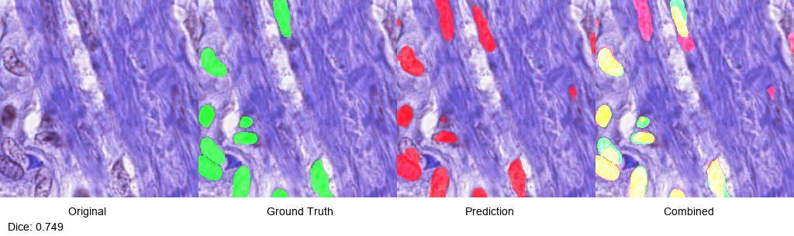
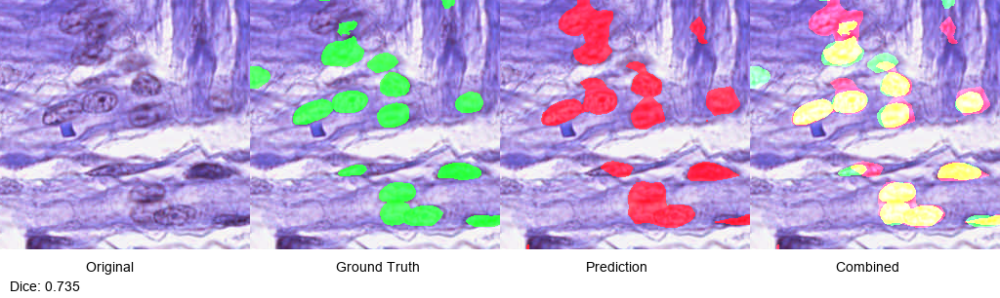

# Medical Image Segmentation with DeepLabV3

> Nuclei segmentation in histopathology images using DeepLabV3 with ResNet50 backbone

## 🎯 Overview

This project implements a deep learning model for automatic nuclei segmentation in medical images. The model achieves **78.98% Dice score** on the PanNuke dataset, demonstrating robust performance for cell nuclei detection.

## 📊 Results

| Metric | Score |
|--------|-------|
| Best Dice Score | 0.7898 (78.98%) |
| Mean Dice | 0.78 ± 0.05 |
| Mean IoU | 0.65 ± 0.06 |

### Segmentation Examples

| Sample 1 (Dice: 0.749) | Sample 2 (Dice: 0.735) |
|------------------------|------------------------|
|  |  |

*Green: Ground Truth | Red: Prediction*

## 🏗️ Model Architecture

- **Backbone:** ResNet50 pretrained on ImageNet
- **Segmentation Head:** DeepLabV3 with ASPP
- **Input Size:** 256x256 pixels
- **Output:** Binary mask (0: Background, 1: Nucleus)

## 📁 Project Structure
